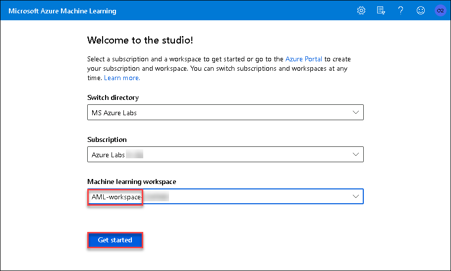

## Exercise 1: Creating a forecast model using automated machine learning

Duration: 40 minutes

In this exercise, you will create a model that predicts battery failure from time-series data using the visual interface to automated machine learning in an Azure Machine Learning workspace.

### Task 1: Create an automated machine learning experiment

1. Navigate to your Azure Machine Learning workspace in the Azure Portal. Select **Try the new Azure Machine Learning studio, Launch now**.

    

2. After Launching , you will be asked to select subscription and Machine learning workspace . select subscription name starting with **Azure Labs** and select machine learning workspace name starting with **AML-workspace-XXXXXX**  . Click on **Get started**

    

3. Select **Automated ML icon** in the left navigation bar.

    

4. Select **+ New automated ML run**.

    

5. Select **+ Create dataset, From web files** to start registering your training data.

    

6. In the `Basic info` section provide the following information and then select **Next**:

   - **Web URL**: `https://databricksdemostore.blob.core.windows.net/data/connected-car/daily-battery-time-series-v2.csv`
  
   - **Name**: `daily-battery-time-series`

    

7. On the Settings and preview form, set the **Column headers** drop down to **All files have same headers**, and then select **Next**.

    

8. Review the training data schema. Toggle the `Include` switch next to the column name to exclude the `Path`, `Column1`, `Number_Of_Trips`, `Lifetime_Cycles_Used` and `Battery_Rated_Cycles` columns. Select **Next**.

    

9. Review the dataset details in the `Confirm details` section and select **Create**.

    

10. Select the `daily-battery-time-series` dataset and then select **Next**.

    

11. Provide the experiment name: `Battery-Cycles` and select **Daily_Cycles_Used** as target column. Select **Create a new compute**.

    

12. For the new compute, provide the following values and then select **Create**:

    - **Compute name**: `auto-ml-compute`
  
    - **Select Virtual Machine size**: `STANDARD_DS3_v2`
  
    - **Minimum number of nodes**: `1`
  
    - **Maximum number of nodes**: `1`

    

    > **Note**: The creation of the new compute may take several minutes. Once the process is completed, select **Next** in the `Configure run` section.

13. Select the `Time series forecasting` task type and provide the following values and then select **View additional configuration settings**:

    - **Time column**: `Date`

    - **Group by column(s)**: `Battery_ID`

    - **Forecast horizon**: `30`

    

14. For the automated machine learning run additional configurations, provide the following values and then select **Save**:

    - **Primary metric**: `Normalized root mean squared error`

    - **Training job time (hours)** (in the `Exit criterion` section): enter `1` as this is the lowest value currently accepted.

    - **Metric score threshold**: enter `0.1355`. When this threshold value will be reached for an iteration metric the training job will terminate.

    

    > **Note**: We are setting a metric score threshold to limit the training time. In practice, for initial experiments, you will typically only set the training job time to allow AutoML to discover the best algorithm to use for your specific data.

15. Select **Finish** to start the new automated machine learning run.

    > **Note**: The experiment should run for up to 10 minutes. If the run time exceeds 15 minutes, cancel the run and start a new one (steps 3, 9, 10, 12, 13, and 14). Make sure you provide a higher value for `Metric score threshold` in step 13.

### Task 2: Review the experiment run results

1. Once the experiment completes, select `Details` to examine the details of the run containing information about the best model and the run summary.

   

2. Select `Models` to see a table view of different iterations and the `Normalized root mean squared error` score for each iteration. Note that the normalized root mean square error measures the error between the predicted value and actual value. In this case, the model with the lowest normalized root mean square error is the best model. Note that Azure Machine Learning Python SDK updates over time and gives you the best performing model at the time you run the experiment. Thus, it is possible that the best model you observe can be different than the one shown below.

    

3. Return to the details of your experiment run and select the best model **Algorithm name**.

    

4. From the `Model` tab, select **View all other metrics** to review the various `Run Metrics` to evaluate the model performance.

    

5. Next, select **Metrics, predicted_true** to review the model performance curve: `Predicted vs True`.

    

### Task 3: Deploy the Best Model

1. From the top toolbar select **Deploy**.

    

2. Provide the `Name`, `Description` and `Compute type`, and then select **Deploy**:

    - **Name**: **battery-cycles**

    - **Description**: **The best AutoML model to predict battery cycles.**

    - **Compute type**: Select `ACI`.

    

3. The model deployment process will register the model, create the deployment image, and deploy it as a scoring webservice in an Azure Container Instance (ACI). To view the deployed model, from Azure Machine Learning studio select **Endpoints icon, Real-time endpoints**.

   

   > **Note**: The `battery-cycles` endpoint will show up in a matter of seconds but the actual deployment takes several minutes. You can check the deployment state of the endpoint by selecting it and then selecting the `Details` tab. A successful de deployment will have a state of `Healthy`.

4. If you see your model deployed in the above list, you are now ready to continue on to the next exercise.
