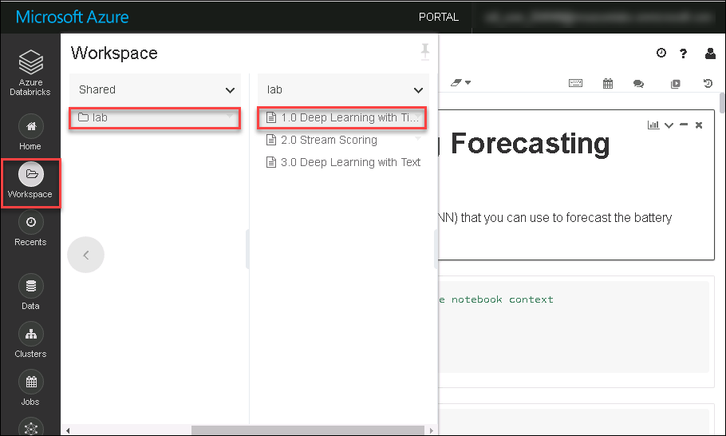

## Exercise 2: Creating a deep learning model (RNN) for time series data

Duration: 45 minutes

### Task 1: Create the model using a notebook

1. Browse to your Azure Databricks service in Azure Portal click on **Launch Workspace**.

2. Click on workspace , go to shared and there will be a folder named **lab** which includes notebook that we are executing throughout the lab.

3. Click on  `AI with Databricks and AML \ 1.0 Deep Learning with Time Series`. This is the notebook you will be executing in this Exercise.

4. Follow the instructions within the notebook to complete the lab.
