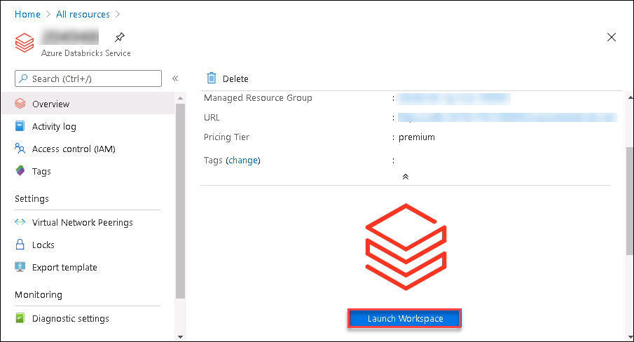
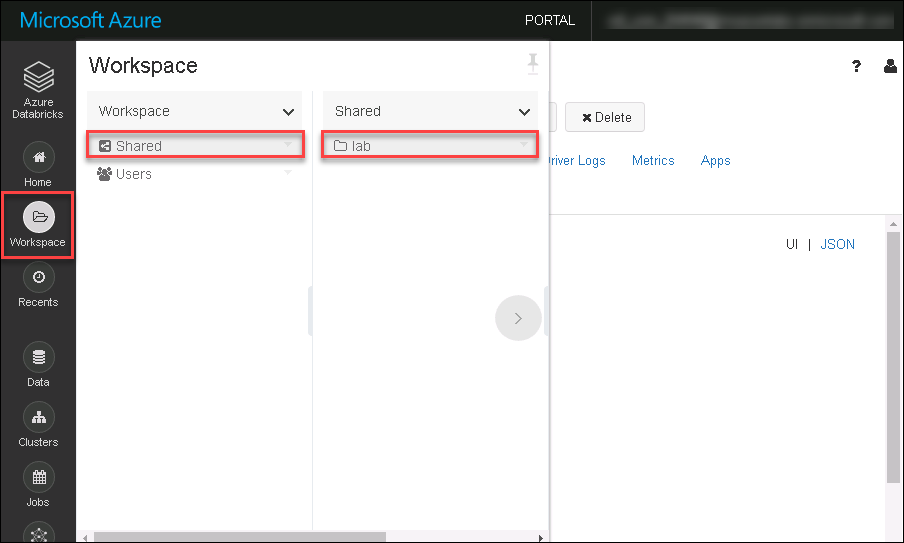
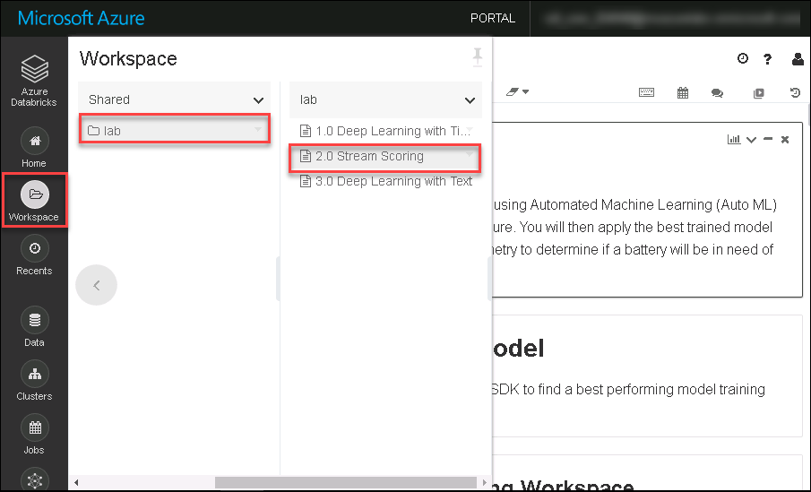

## Exercise 3: Using a forecast model for scoring of streaming telemetry

Duration: 45 minutes

In this exercise, you will apply the forecast model to a Spark streaming job in order to make predictions against streaming data.

### Task 1: Create the streaming job using a notebook

1. Browse to your Azure Databricks service in Azure Portal click on **Launch Workspace**.

2. Click on workspace , go to shared and there will be a folder named **lab** which includes notebook that we are executing throughout the lab.

3. Browse to your Azure Databricks Workspace and navigate to `AI with Databricks and AML \ 2.0 Stream Scoring`. This is the notebook you will be executing in this lab.

4. Follow the instructions within the notebook to complete the lab.
