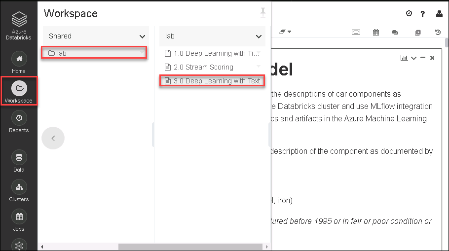

## Exercise 4: Creating, training and tracking a deep learning text classification model with Azure Databricks, MLflow and Azure Machine Learning

Duration: 45 minutes

In this exercise, you create a model for classifying component text as compliant or non-compliant. You will train the model on the Azure Databricks cluster and use MLflow integration with Azure Machine Learning to track and log experiment metrics and artifacts in the Azure Machine Learning workspace.

### Task 1: Create, train and track the classification model using a notebook

1. Browse to your Azure Databricks service in Azure Portal click on **Launch Workspace**.

2. Click on workspace , go to shared and there will be a folder named **lab** which includes notebook that we are executing throughout the lab.

3. Browse to your Azure Databricks Workspace and navigate to `AI with Databricks and AML \ 3.0 Deep Learning with Text`. This is the notebook you will be executing in this lab.

4. Follow the instructions within the notebook to complete the lab.

### Task 2: Review model performance metrics and training artifacts in Azure Machine Learning workspace

1. Select the **Link to Azure Machine Learning studio** from the output of the last cell in the notebook to open the `Run Details` page in the Azure Machine Learning studio.

   

2. The **Run Details** page shows the three metrics that were logged via MLflow during the model training process: **learning rate (lr)**, **evaluation loss (eval_loss)**, and **evaluation accuracy (eval_accuracy)**.

   

3. Next, select **Outputs + logs, training_results.png** to review the model training artifacts logged using MLflow. In this section, you can review the curves showing both accuracy and loss as the model training progress. You can also observe that MLflow logs the trained model and the training history with Azure Machine Learning workspace.

   
