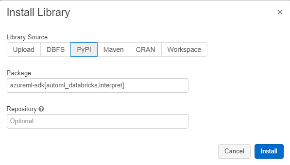

Machine Learning

Before the hands-on lab setup guide

November 2019

Information in this document, including URL and other Internet Web site references, is subject to change without notice. Unless otherwise noted, the example companies, organizations, products, domain names, e-mail addresses, logos, people, places, and events depicted herein are fictitious, and no association with any real company, organization, product, domain name, e-mail address, logo, person, place or event is intended or should be inferred. Complying with all applicable copyright laws is the responsibility of the user. Without limiting the rights under copyright, no part of this document may be reproduced, stored in or introduced into a retrieval system, or transmitted in any form or by any means (electronic, mechanical, photocopying, recording, or otherwise), or for any purpose, without the express written permission of Microsoft Corporation.

Microsoft may have patents, patent applications, trademarks, copyrights, or other intellectual property rights covering subject matter in this document. Except as expressly provided in any written license agreement from Microsoft, the furnishing of this document does not give you any license to these patents, trademarks, copyrights, or other intellectual property.

The names of manufacturers, products, or URLs are provided for informational purposes only and Microsoft makes no representations and warranties, either expressed, implied, or statutory, regarding these manufacturers or the use of the products with any Microsoft technologies. The inclusion of a manufacturer or product does not imply endorsement of Microsoft of the manufacturer or product. Links may be provided to third party sites. Such sites are not under the control of Microsoft and Microsoft is not responsible for the contents of any linked site or any link contained in a linked site, or any changes or updates to such sites. Microsoft is not responsible for webcasting or any other form of transmission received from any linked site. Microsoft is providing these links to you only as a convenience, and the inclusion of any link does not imply endorsement of Microsoft of the site or the products contained therein.

© 2019 Microsoft Corporation. All rights reserved.

Microsoft and the trademarks listed at <https://www.microsoft.com/en-us/legal/intellectualproperty/Trademarks/Usage/General.aspx> are trademarks of the Microsoft group of companies. All other trademarks are property of their respective owners.

**Contents**

<!-- TOC -->

- [Machine Learning before the hands-on lab setup guide](#machine-learning-before-the-hands-on-lab-setup-guide)
  - [Requirements](#requirements)
  - [Before the hands-on lab](#before-the-hands-on-lab)
    - [Task 1: Create your Azure Databricks Account](#task-1-create-your-azure-databricks-account)
    - [Task 2: Create an Azure Databricks cluster](#task-2-create-an-azure-databricks-cluster)
    - [Task 3: Install libraries on the Azure Databricks Cluster](#task-3-install-libraries-on-the-azure-databricks-cluster)
    - [Task 4: Upload the Databricks notebook archive](#task-4-upload-the-databricks-notebook-archive)
    - [Task 5: Create your Azure Machine Learning Workspace](#task-5-create-your-azure-machine-learning-workspace)
    - [Task 6: Download training data to your local machine](#task-6-download-training-data-to-your-local-machine)

<!-- /TOC -->

# Machine Learning before the hands-on lab setup guide

## Requirements

1. Microsoft Azure subscription must be pay-as-you-go or MSDN

    - Trial subscriptions will not work. You will run into issues with Azure resource quota limits.

    - Subscriptions with access limited to a single resource group will not work. You will need the ability to deploy multiple resource groups.

## Before the hands-on lab

Duration: 30 minutes

### Task 1: Create your Azure Databricks Account

Azure Databricks is an Apache Spark-based analytics platform optimized for Azure that supports data engineering and machine learning and deep learning workloads.

1. In the [Azure Portal](https://portal.azure.com), select **+ Create a resource**, then type "Azure Databricks" into the search bar. Select Azure Databricks from the results.

    

2. Select **Create**.

    

3. Set the following configuration on the Azure Databricks Service creation form:

    - **Workspace name**: Enter a unique name as indicated by a green checkmark.

    - **Subscription**: Select the subscription you are using for this hands-on lab.

    - **Resource Group**: Select **Create new** and provide the name `MCW-AI-Lab`.

    - **Location**: Select a region close to you. ***(If you are using an Azure Pass, select South Central US.)***

    - **Pricing**: Select Premium.

    

4. Select **Create** to finish and submit.

### Task 2: Create an Azure Databricks cluster

You have provisioned an Azure Databricks workspace, and now you need to create a new cluster within the workspace.

1. From the side menu in the Azure portal, select **Resource groups**, then enter your resource group name (e.g., `MCW-AI-Lab`) into the filter box, and select it from the list.

2. Next, select your Azure Databricks service from the list.

    

3. In the Overview pane of the Azure Databricks service, select **Launch Workspace**.

    

    Azure Databricks will automatically log you in using Azure Active Directory Single Sign On.

    

4. Select **Clusters** (1) from the menu, then select **Create Cluster** (2).

    

5. On the Create New Cluster form, provide the following:

    - **Cluster Name**: lab

    - **Cluster Mode**: Standard

    - **Databricks Runtime Version**: Runtime: 6.2 (Scala 2.11, Spark 2.4.4)

    - **Enable autoscaling**: Uncheck this option.

    - **Auto Termination**: Leave checked and in the text box enter `120`.

    - **Worker Type**: Standard_DS3_v2

    - **Workers**: 1

    - **Driver Type**: Same as worker

   

6. Select **Create Cluster**. It will take few minutes to create the cluster. Please ensure that the cluster state is running before proceeding further.

### Task 3: Install libraries on the Azure Databricks Cluster

The notebooks you will run depends on certain Python libraries that will need to be installed in your cluster. The following steps walk you through adding these dependencies.

1. From the left-hand menu in your Workspace, select **Clusters**.

    

2. In the list of clusters, select your cluster. Make sure the state of the cluster is `Running`.

    

3. Select the **Libraries** link and then select **Install New**.

    

4. In the Library Source, select **PyPi** and in the Package text box type `azureml-sdk[automl_databricks,interpret]` and select **Install**.

    

5. An entry for azureml-sdk will appear in the list with a status of installing followed by installed.

### Task 4: Upload the Databricks notebook archive

1. Within the Azure Databricks Workspace, using the command bar on the left, select Workspace, Users and select your username (the entry with house icon).

2. In the blade that appears, select the downwards pointing chevron next to your name, and select Import.

3. On the Import Notebooks dialog, select URL and paste in the following URL:

    `https://github.com/microsoft/MCW-Machine-Learning/blob/master/Hands-on%20lab/notebooks/AI%20with%20Databricks%20and%20AML.dbc?raw=true`

4. Select **Import**.

5. A folder named after the archive should appear. Select that folder.

6. The folder will contain one or more notebooks. These are the notebooks you will use in completing this lab.

### Task 5: Create your Azure Machine Learning Workspace

1. In the [Azure Portal](https://portal.azure.com), select **+ Create a resource**, then type `Azure Machine Learning` into the search bar. Select `Machine Learning` from the results.

    

2. Select **Create**.

    

3. In the Create Machine Learning Workspace dialog that appears, provide the following values:

    - **Workspace Name**: AML-workspace

    - **Subscription**: Choose your Azure subscription.

    - **Resource group**: Select the resource group in which you deployed your Azure Databricks workspace.

    - **Location**: Choose a region closest to you (it is OK if the Azure Databricks Workspace and the Azure Machine Learning Workspace are in different locations).

    - **Workspace edition**: Select `Enterprise`.

    

4. Select **Review + Create** and then select **Create** on the dialog that appears.

### Task 6: Download training data to your local machine

1. Download the data from https://databricksdemostore.blob.core.windows.net/data/connected-car/daily-battery-time-series-v2.csv. Please ensure that the name of the downloaded file is `daily-battery-time-series-v2.csv`. Make a note of the location where you saved the file as you will need it during the lab.

You should follow all these steps provided _before_ attending the Hands-on lab.
