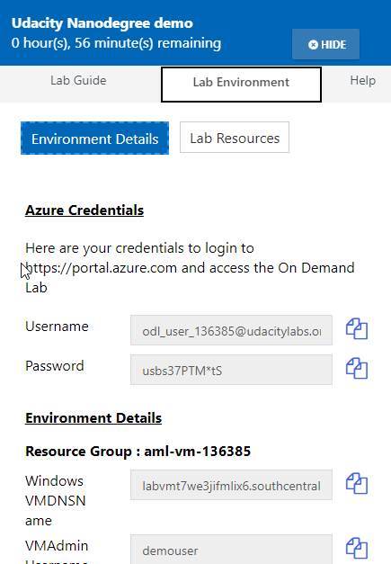
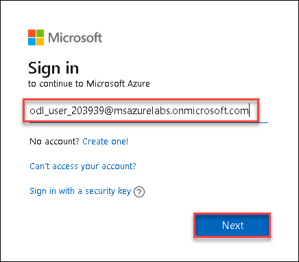
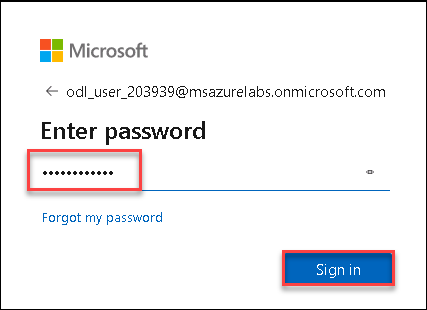
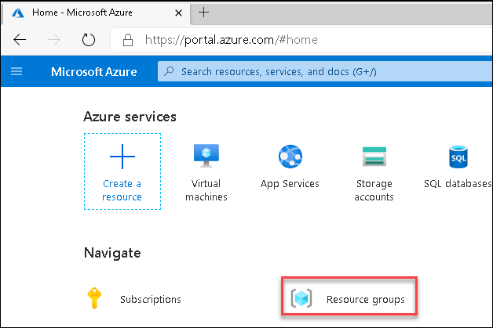
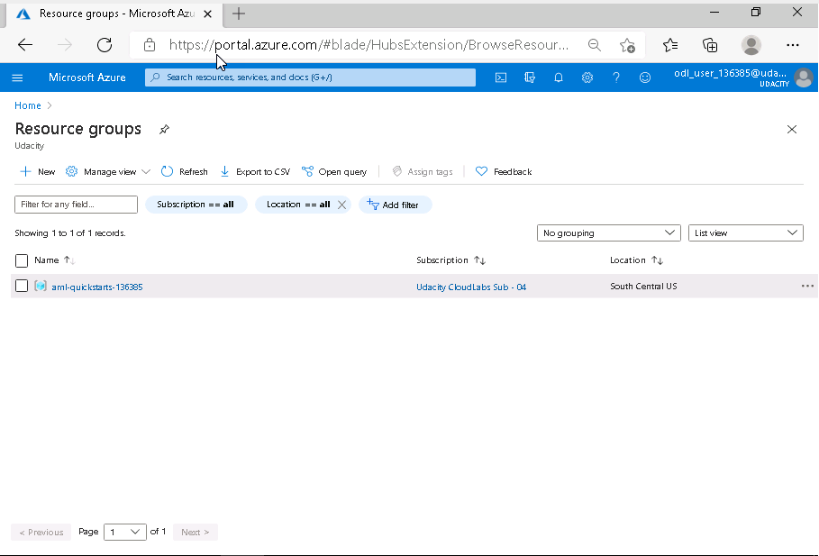

# Getting Started with Lab

1. Once the environment is provisioned, a virtual machine (Kali inux VM) will get loaded. Use this virtual machine throughout the workshop to perform the the lab.
1. To get the lab environment details, you can select **Lab Environment** tab. All the required lab resource details will be available in the Lab environment page.

   
 
## Login to Azure Portal
1. In the Kali VM, open the browser and navigate to https://portal.azure.com
   
2. On **Sign in to Micsoft Azure** tab you will see login screen, in that enter following Azure username and then click on **Next**. 
   * Email/Username: <inject key="AzureAdUserEmail"></inject>
   
     
     
3. Now enter the following Azure password and click on **Sign in**.
   * Password: <inject key="AzureAdUserPassword"></inject>
   
     
     
4. If you see the pop-up **Stay Signed in?**, click No

5. If you see the pop-up **You have free Azure Advisor recommendations!**, close the window to continue the lab.

6. If a **Welcome to Microsoft Azure** popup window appears, click **Maybe Later** to skip the tour.
   
7. Now you will see Azure Portal Dashboard, click on **Resource groups** to see the resource groups.

   
   
8. Confirm you have all resource group are present as shown below.

   
   
9. Now, Open the **Resource group** to see all the resource deployed for you.
